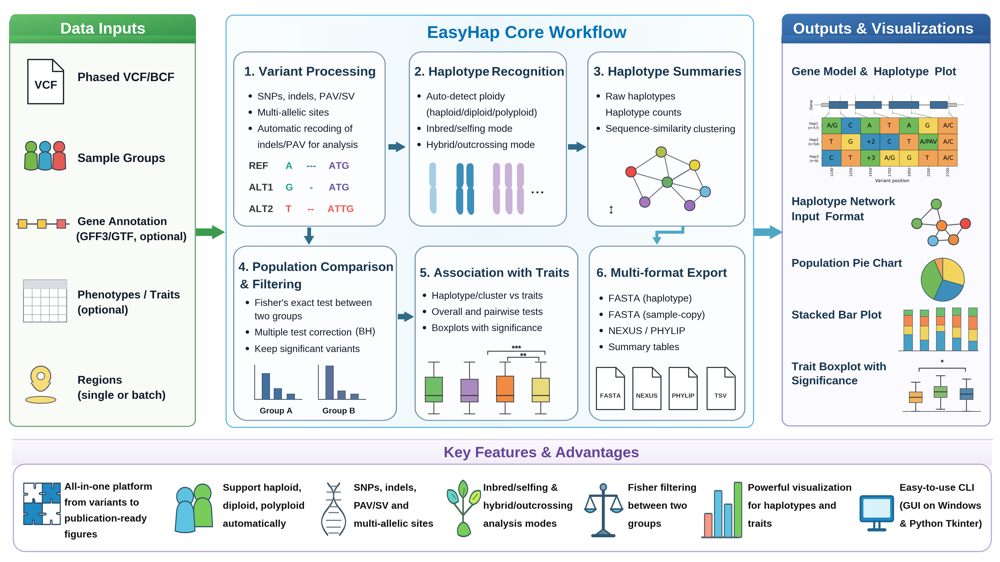
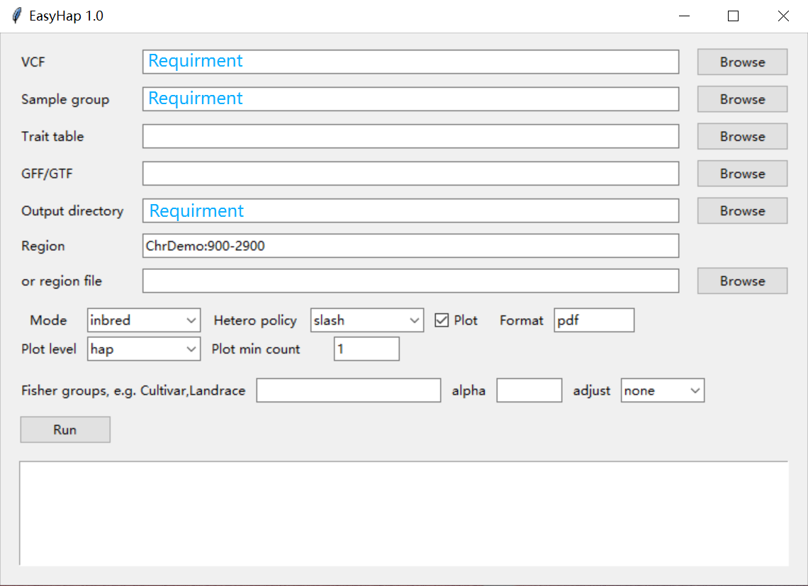
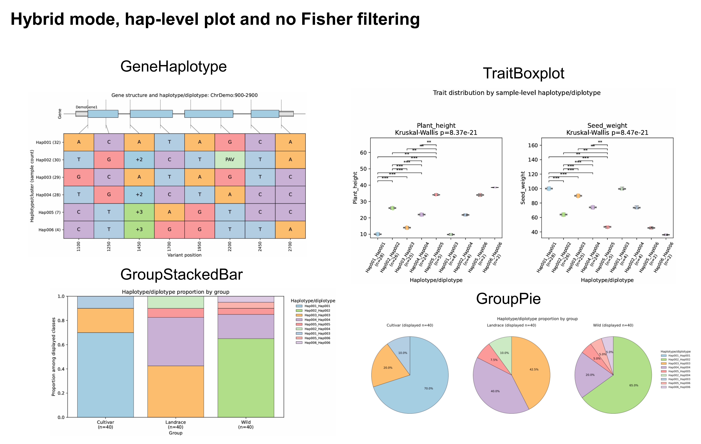
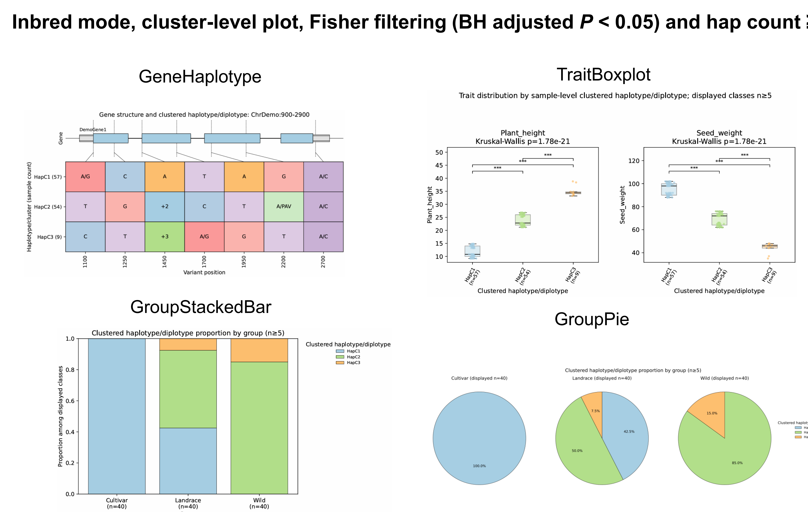

<p align="center">
  
</p>

**EasyHap** is a cross-platform toolkit for regional haplotype analysis and visualization using phased VCF data from fungal, plant, and animal population resequencing projects.
EasyHap automatically recognizes haploid, diploid, and polyploid genotypes, supports both inbred/selfing and hybrid/outcrossing analysis strategies, and integrates variant recoding, haplotype reconstruction, population comparison, sequence-similarity clustering, sequence export, phenotype association, and publication-ready visualization.
## Core workflow of EasyHap

## Key features
- Linux command-line interface: `easyhap`
- Windows-friendly Tkinter GUI: `EasyHap_v1.0.exe`
- Phased haploid, diploid, and polyploid genotypes
- Inbred/selfing and hybrid/outcrossing analysis modes
- SNPs, indels, PAV/SV alleles, and multiallelic sites
- Optional Fisher exact filtering between two population groups
- Raw haplotype and sequence-similarity cluster summaries
- FASTA, NEXUS, PHYLIP, and sample-copy FASTA output
- Haplotype heatmaps, gene-model plots, combined group pie charts, stacked bars, and trait boxplots with significance tests

## Installation
### Windows
The Windows release provides a standalone executable and does not require a separate Python installation.
1. Download and extract `EasyHap-1.0.zip`.
2. Open the `windows` directory.
3. Double-click `EasyHap.exe`.
4. Use the supplied example files to test the workflow.

### Linux
EasyHap requires Python 3 and the following core packages:
- `pandas >= 1.5`
- `numpy >= 1.23`
- `matplotlib >= 3.6`
- `scipy >= 1.10`
- `cyvcf2 >= 0.30`
#### installation with an existing Python environment
```bash
unzip EasyHap-1.0.zip
cd EasyHap-1.0/Linux
python3 -m pip install "pandas>=1.5" "numpy>=1.23" "matplotlib>=3.6" "scipy>=1.10" "cyvcf2>=0.30"
python3 -m pip install -e .
easyhap --version
```
#### installation in a Conda environment
```bash
conda create -n easyhap python=3.10 -y
conda activate easyhap
python -m pip install "pandas>=1.5" "numpy>=1.23" "matplotlib>=3.6" "scipy>=1.10" "cyvcf2>=0.30"
unzip EasyHap-1.0.zip
cd EasyHap-1.0/Linux
python -m pip install -e .
easyhap --version
```
From the Linux source directory, the Tkinter interface can be launched with either command: `python easyhap_gui.py`

## Input files
EasyHap requires a phased VCF and a sample-group table. A trait table, region list, and gene annotation file are optional.
### 1. Phased VCF, VCF.GZ, or BCF file — required

EasyHap accepts standard VCF, compressed VCF, or BCF files containing phased genotypes. Phased alleles should be separated by `|`, for example:
```text
0|1
1|0
0|1|1|0
```
EasyHap automatically infers ploidy from the genotype fields; users do not need to specify whether the samples are haploid, diploid, or polyploid. For sequence-aware analysis of indels and PAV/SV alleles, sequence-resolved `REF` and `ALT` alleles are recommended. Symbolic alleles such as `<PAV>` do not contain the inserted sequence and therefore cannot provide full sequence reconstruction. For large datasets, use bgzip-compressed and indexed VCF files. Indexed files substantially accelerate regional access.
#### Example VCF
```vcf
##fileformat=VCFv4.2
##source=EasyHap-1.0-demo
##contig=<ID=ChrDemo,length=5000>
##INFO=<ID=SVTYPE,Number=1,Type=String,Description="Structural variant type">
##FORMAT=<ID=GT,Number=1,Type=String,Description="Phased genotype">
#CHROM	POS	ID	REF	ALT	QUAL	FILTER	INFO	FORMAT	C001	C002	C003	C004
ChrDemo	1100	demoV1	A	G,T,C	.	PASS	.	GT	0|1	0|1	0|1	0|1
ChrDemo	1250	demoV2	C	G,T	.	PASS	.	GT	0|0	0|0	0|0	0|0
ChrDemo	1450	demoV3	A	ATG,ATTG	.	PASS	.	GT	0|0	0|0	0|0	0|0
ChrDemo	1700	demoV4	T	C,A,G	.	PASS	.	GT	0|0	0|0	0|0	0|0
```
### 2. Sample-group table — required
The sample-group file must be tab-delimited and must not contain a header.
```text
C001	Cultivar
C002	Cultivar
C003	Landrace
```
The first column contains sample names and the second column contains population or experimental group names. Sample names must exactly match those in the VCF header.
### 3. Trait table — optional
The trait table must be tab-delimited and contain a header. The first column contains sample or accession names, and the remaining columns contain numerical traits.
```text
Accession	Plant_height	Seed_weight
C001	9.2	98.0
C002	9.6	100.0
C003	10.0	102.0
C004	10.4	104.0
```
The sample names in the first column must match the VCF sample names. One or more traits can be selected with `--trait-cols`.
### 4. Region file — optional
A region file enables batch analysis of multiple genomic intervals. It must be tab-delimited and must not contain a header.
```text
ChrDemo	900	2900
ChrDemo	3000	4200
```
Use `--region` for one interval (chr:start-end) or `--region-file` for multiple intervals. The two options are alternatives.
### 5. GFF3 or GTF annotation — optional
A GFF3 or GTF file can be supplied to draw gene structures together with haplotype and variant information.
```gff
##gff-version 3
ChrDemo	EasyHap	gene	1000	2800	.	+	.	ID=DemoGene1;Name=DemoGene1
ChrDemo	EasyHap	mRNA	1000	2800	.	+	.	ID=DemoGene1.1;Parent=DemoGene1
ChrDemo	EasyHap	exon	1000	1350	.	+	.	ID=exon1;Parent=DemoGene1.1
ChrDemo	EasyHap	five_prime_UTR	1000	1099	.	+	.	ID=utr5;Parent=DemoGene1.1
ChrDemo	EasyHap	CDS	1100	1350	.	+	0	ID=cds1;Parent=DemoGene1.1
ChrDemo	EasyHap	exon	1450	1800	.	+	.	ID=exon2;Parent=DemoGene1.1
ChrDemo	EasyHap	CDS	1450	1800	.	+	0	ID=cds2;Parent=DemoGene1.1
ChrDemo	EasyHap	exon	1900	2300	.	+	.	ID=exon3;Parent=DemoGene1.1
ChrDemo	EasyHap	CDS	1900	2300	.	+	0	ID=cds3;Parent=DemoGene1.1
ChrDemo	EasyHap	exon	2450	2800	.	+	.	ID=exon4;Parent=DemoGene1.1
ChrDemo	EasyHap	CDS	2450	2680	.	+	0	ID=cds4;Parent=DemoGene1.1
ChrDemo	EasyHap	three_prime_UTR	2681	2800	.	+	.	ID=utr3;Parent=DemoGene1.1
```
Chromosome or contig identifiers must be consistent among the VCF, region specification, and GFF3/GTF file.
## Preparing the VCF
The following commands are examples. Adjust filenames, thresholds, reference files, and computing resources for the dataset being analyzed.
### Filter variants by missingness and minor-allele frequency
```bash
vcftools --gzvcf sample.snp.pass.vcf.gz --max-missing 0.8 --maf 0.01 --recode --stdout | bgzip -c > sample.snp.popfilter.vcf.gz
bcftools index -t sample.snp.popfilter.vcf.gz
```
### Combine SNP, indel, and PAV/SV files

The input files should contain the same samples in the same order.
```bash
bcftools concat -a sample.snp.popfilter.vcf.gz sample.indel.popfilter.vcf.gz sample.pav.popfilter.vcf.gz -Ou |
  bcftools sort -Oz -o sample.snp_indel_pav.vcf.gz
bcftools index -t sample.snp_indel_pav.vcf.gz
```
### Retain only biallelic variants
EasyHap supports multiallelic sites. Biallelic filtering is optional.
```bash
bcftools view -m2 -M2  -Oz -o sample.snp_indel_pav.biallelic.vcf.gz sample.snp_indel_pav.vcf.gz
bcftools index -t sample.snp_indel_pav.biallelic.vcf.gz
```
### Phase diploid genotypes
One possible option for diploid data is Beagle:
```bash
java -jar beagle.27Feb25.75f.jar gt=sample.snp_indel_pav.vcf.gz out=sample.snp_indel_pav_beagle seed=123 nthreads=48
bcftools index -t sample.snp_indel_pav_beagle.vcf.gz
```
For polyploid datasets, use a phasing method appropriate for the species, ploidy level, sequencing design, and variant type before running EasyHap.
## Command-line interface
Display the main help page: `easyhap -h`
```text
usage: easyhap [-h] [--version] {prepare,analyze} ...

EasyHap 1.0: haplotype analysis for phased VCF regions from
fungi, plants, and animals.

positional arguments:
  {prepare,analyze}
    prepare          Convert REF/ALT alleles into compact downstream tokens
    analyze          Run haplotype summarization, filtering, alignments,
                     and optional plots

options:
  -h, --help         show this help message and exit
  --version          show program's version number and exit
```
EasyHap contains two subcommands:
- `prepare`: converts original `REF` and `ALT` alleles into compact tokens suitable for downstream analysis and plotting.
- `analyze`: performs the complete analysis, including allele recoding, haplotype reconstruction, filtering, clustering, sequence export, and optional plotting.
The allele-preparation procedure is already integrated into `easyhap analyze`; most users do not need to run `easyhap prepare` separately.

### Analyze command
```bash
easyhap analyze -h
```
The required arguments are: `--vcf`, `--group` and `--outdir`. At least one genomic region should be supplied through `--region` or `--region-file`.

| Argument | Description |
|---|---|
| `--vcf` | Phased VCF, VCF.GZ, or BCF file |
| `--group` | Tab-delimited sample-group file without a header |
| `--region` | One interval, for example `Chr10:1-500` |
| `--region-file` | Tab-delimited batch region file without a header |
| `--outdir` | Output directory |
| `--mode {inbred,hybrid}` | Haplotype reconstruction strategy |
| `--hetero-policy {slash,iupac,missing}` | Encoding of heterozygous sites in inbred mode |
| `--traits` | Optional tab-delimited trait table |
| `--trait-cols` | Comma-separated trait columns to analyze |
| `--fisher-groups` | Two groups used for Fisher filtering, for example `Cultivar,Landrace` |
| `--fisher-alpha` | Raw or adjusted P-value cutoff for Fisher filtering |
| `--fisher-adjust {none,bh}` | Multiple-testing correction for Fisher filtering |
| `--cluster-threshold` | Normalized Hamming-distance threshold for haplotype clustering |
| `--vcf-backend {auto,cyvcf2,pysam,plain}` | VCF reader backend |
| `--no-processed` | Do not write processed variant and genotype-token tables |
| `--plot` | Generate graphical outputs |
| `--gff` | Optional GFF3/GTF file for the gene-haplotype plot |
| `--plot-format` | Comma-separated figure formats: `pdf`, `svg`, and/or `png` |
| `--plot-hap-level {hap,cluster}` | Plot raw haplotypes or similarity clusters |
| `--plot-min-count` | Minimum class count displayed in plots |

## Analysis modes
### Hybrid mode

```text
--mode hybrid
```
Hybrid mode reconstructs phased chromosome-copy-level haplotypes. It is suitable for heterozygous diploid samples, hybrid or outcrossing populations, and phased polyploid genotypes. Each phased copy is analyzed separately, preserving the copy-level allele arrangement.
### Inbred mode
```text
--mode inbred
```
Inbred mode constructs genotype-level haplotype profiles and is intended for inbred or predominantly selfing populations in which most loci are expected to be homozygous.
Heterozygous sites can be represented using:
- `--hetero-policy slash`: retain an explicit form such as `A/G`
- `--hetero-policy iupac`: use an IUPAC ambiguity code when possible
- `--hetero-policy missing`: encode heterozygous sites as missing
The selected analysis mode should reflect the population structure and biological interpretation of the data, not only the nominal ploidy.
## Example 1: hybrid-mode analysis
```bash
easyhap analyze \
  --vcf ./examples/demo_diploid_multiallelic.vcf \
  --group ./examples/sample_group.tsv \
  --gff ./examples/demo.gff3 \
  --region ChrDemo:900-2900 \
  --mode hybrid \
  --traits ./examples/traits.tsv \
  --trait-cols Plant_height,Seed_weight \
  --vcf-backend plain \
  --plot \
  --plot-format pdf \
  --outdir demo_diploid
```
Expected terminal output:
```text
Finished 1 region(s).
[ChrDemo:900-2900]
  HapSummary: demo_diploid/ChrDemo_900_2900.HapSummary.tsv
  HapGroup:   demo_diploid/ChrDemo_900_2900.HapGroup.tsv
  Prefix:     demo_diploid/ChrDemo_900_2900
```
Example graphical output:

## Example 2: inbred mode with population filtering and clustering
```bash
easyhap analyze \
  --vcf ./examples/demo_diploid_multiallelic.vcf \
  --group ./examples/sample_group.tsv \
  --gff ./examples/demo.gff3 \
  --region ChrDemo:900-2900 \
  --mode inbred \
  --hetero-policy slash \
  --fisher-groups Cultivar,Landrace \
  --fisher-alpha 0.05 \
  --fisher-adjust bh \
  --traits ./examples/traits.tsv \
  --trait-cols Plant_height,Seed_weight \
  --vcf-backend plain \
  --plot \
  --plot-format pdf \
  --plot-hap-level cluster \
  --cluster-threshold 0.5 \
  --plot-min-count 5 \
  --outdir demo_diploid_2
```
Example graphical output:

This example differs from the hybrid-mode analysis in several important ways:
1. **Fisher filtering changes the variant set.**  
   `--fisher-groups Cultivar,Landrace --fisher-alpha 0.05 --fisher-adjust bh` retains variants whose allele-frequency differences between the two specified groups pass the Benjamini-Hochberg-adjusted threshold.
2. **Similarity clustering reduces redundant haplotype classes.**  
   `--plot-hap-level cluster` uses cluster labels rather than raw haplotype labels in the plots. `--cluster-threshold` controls the normalized Hamming-distance threshold. A larger threshold allows more divergent haplotypes to become connected within the same cluster.
3. **The minimum-count option affects plot display.**  
   `--plot-min-count 5` displays only haplotype or cluster classes represented by at least five samples or accessions. It is a plotting threshold and should not be interpreted as Fisher filtering of variant sites.
4. **Inbred mode uses genotype-level classes.**  
   This avoids unnecessary emphasis on phased multi-copy combinations in populations that are predominantly homozygous.
## Batch analysis of multiple regions
Use `--region-file` instead of `--region`:
```bash
easyhap analyze \
  --vcf sample.phased.vcf.gz \
  --group sample_group.tsv \
  --region-file regions.tsv \
  --mode inbred \
  --plot \
  --plot-format pdf,png \
  --outdir easyhap_batch
```
Each interval receives a separate output prefix based on its chromosome, start position, and end position.
## Output files
For a region such as `ChrDemo:900-2900`, EasyHap uses the prefix: ChrDemo_900_2900
Depending on the selected options, the output directory may contain:
| Output file | Description |
|---|---|
| `*.AlleleStateMap.tsv` | Mapping between original allele/genotype tokens and compact encoded states |
| `*.ProcessedVariants.tsv` | Variant table containing normalized allele tokens |
| `*.SampleGenotypeTokens.tsv` | Per-site encoded genotype states for all samples |
| `*.HapSummary.tsv` | Raw haplotypes, cluster assignments, allele states, accessions, and counts |
| `*.HapGroup.tsv` | Sample-level haplotype, cluster, group, and optional trait information |
| `*.Haplotype.fa` | Nonredundant haplotype sequences in FASTA format |
| `*.Haplotype_sample.fa` | Sample-copy or sample-level haplotype sequences in FASTA format |
| `*.Haplotype.nex` | Haplotype alignment in NEXUS format |
| `*.Haplotype.phy` | Haplotype alignment in PHYLIP format |
| `*.TraitSignificance.tsv` | Overall and pairwise statistical tests for selected traits |
| `*.GeneHaplotype.pdf` | Gene structure and haplotype/variant visualization |
| `*.HaplotypeHeatmap.pdf` | Haplotype-state heatmap |
| `*.GroupPie.pdf` | Population composition of haplotypes or clusters |
| `*.GroupStackedBar.pdf` | Stacked haplotype-frequency plot across groups |
| `*.TraitBoxplot.pdf` | Trait distributions across haplotypes or clusters |

### Allele-state map
Example:
```text
CHROM	POS	OriginalToken	EncodedState
ChrDemo	1100	A	A
ChrDemo	1100	A/G	N
ChrDemo	1100	T	T
```
This file records how original sequence or genotype tokens were converted for downstream summaries and plotting.
### Processed variants
Example:

```text
CHROM	POS	ID	REF	ALT	AlleleTokens
ChrDemo	1100	demoV1	A	G,T,C	A,G,T,C
ChrDemo	1250	demoV2	C	G,T	C,G,T
ChrDemo	1450	demoV3	A	ATG,ATTG	A,+2,+3
```
Sequence-length changes can be represented by compact tokens such as `+2` or `+3`.
### Sample genotype tokens
Example:
```text
CHROM	POS	ID	C001	C002
ChrDemo	1100	demoV1	A/G	A/G
ChrDemo	1250	demoV2	C/C	C/C
ChrDemo	1450	demoV3	A/A	A/A
```
### Haplotype summary
Example:
```text
Hap	ClusterID	1100	1250	1450	1700	1950	2200	2700	Accession	Number
CHR		ChrDemo	ChrDemo	ChrDemo	ChrDemo	ChrDemo	ChrDemo	ChrDemo		NA
POS		1100	1250	1450	1700	1950	2200	2700		NA
Hap001	HapC1	A	C	A	T	A	G	A	C005;C006;C007;C008	4
Hap002	HapC2	T	G	+2	C	T	PAV	A	L029;L030;L031;L032	4
Hap003	HapC1	G	C	A	T	A	G	C	C033;C034;C035;C036	4
```
### Haplotype-group table
Example:
```text
Hap	ClusterID	Accession	Type	Plant_height	Seed_weight
Hap006	HapC1	C001	Cultivar	9.2	98.0
Hap006	HapC1	C002	Cultivar	9.6	100.0
Hap006	HapC1	C003	Cultivar	10.0	102.0
```
This table links each sample to its haplotype or cluster, population group, and optional phenotypic values.
### Sample-copy FASTA
Example:
```fasta
>C001|Hap006
NCATAGG
>C002|Hap006
NCATAGG
>C003|Hap006
NCATAGG
```
The FASTA, NEXUS, and PHYLIP outputs can be used in downstream phylogenetic or haplotype-network analyses.
### Trait significance table
Example:
```text
Trait	PlotLevel	ComparisonType	Class1	Class2	N1	N2	Mean1	Mean2	Test	pvalue	padj_BH	Significance	SkippedReason
Plant_height	cluster	overall	ALL		120				Kruskal-Wallis	1.7836930520288015e-21	1.7836930520288015e-21	***
Plant_height	cluster	pairwise	HapC1	HapC2	57	54	11.733333333333334	23.91111111111111	two-sided Mann-Whitney U	1.0035648099855903e-19	3.010694429956771e-19	***
```
For each selected trait, EasyHap can report:
- an overall Kruskal-Wallis test across displayed classes;
- pairwise two-sided Mann-Whitney U tests;
- Benjamini-Hochberg-adjusted pairwise P values;
- significance labels used in the trait boxplots.

## Plot generation

Plotting is enabled with: `--plot`
Optional plot-related inputs and parameters include:
```bash
--gff annotation.gff3
--traits traits.tsv
--trait-cols Plant_height,Seed_weight
--plot-format pdf,svg,png
--plot-hap-level cluster
--plot-min-count 5
```
Plot availability depends on the supplied files:
- `GeneHaplotype`: requires `--gff`
- `TraitBoxplot` and `TraitSignificance`: require `--traits` and `--trait-cols`
- group-composition plots require valid group assignments
- all graphical outputs require `--plot`
## Recommendations
- Use phased genotypes and verify that the genotype separator is `|`, not `/`.
- Ensure that sample names are identical across the VCF, group table, and trait table.
- Use the same chromosome or contig identifiers in the VCF, region file, and GFF3/GTF annotation.
- Compress and index large VCF files before regional analysis.
- Prefer sequence-resolved alleles when analyzing indels and PAV/SV variants.
- Inspect missingness and minor-allele frequency before haplotype reconstruction.
- Avoid excessively large regions containing many independent variants, because they may generate a very large number of rare haplotypes.
- Use Fisher filtering only when the analysis is explicitly focused on differentiation between two population groups.
- Report the selected clustering threshold and analysis mode when publishing results.
- Retain raw haplotype outputs even when cluster-level plots are used.
## Citation
When EasyHap contributes to published work, please cite the software name, version, and GitHub repository. A formal publication or archived DOI can be added here when available.
## License

Copyright (C) 2026 Guangqi He.

EasyHap is free software distributed under the terms of the GNU General Public License, version 3 only (`GPL-3.0-only`). See the [LICENSE](LICENSE) file for the complete license text.
