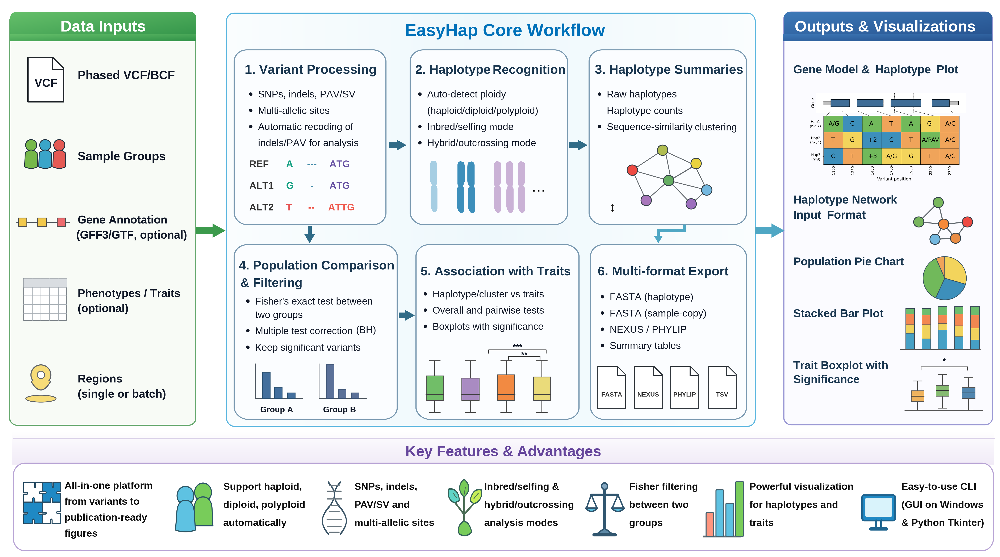
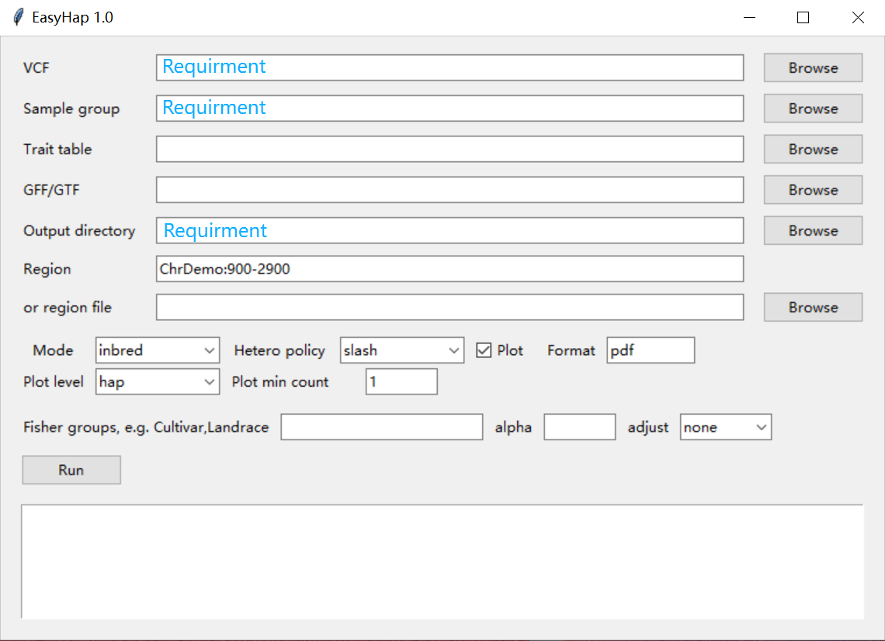

<p align="center">
  
</p>

**EasyHap** is a cross-platform toolkit for regional haplotype analysis and visualization using phased VCF data from fungal, plant, and animal population resequencing projects.
EasyHap automatically recognizes haploid, diploid, and polyploid genotypes, supports both inbred/selfing and hybrid/outcrossing analysis strategies, and integrates variant recoding, haplotype reconstruction, population comparison, sequence-similarity clustering, sequence export, phenotype association, and publication-ready visualization.

Repository: https://github.com/Guangqi-He/EasyHap  
Documentation: https://github.com/Guangqi-He/EasyHap/wiki  
License: GPL-3.0-or-later
## Workflow 

## Key features
- Phased VCF, VCF.GZ, and BCF input
- Haploid, diploid, and polyploid genotype support
- Inbred/selfing and hybrid/outcrossing analysis modes
- SNPs, indels, multiallelic sites, and sequence/symbolic PAV/SV alleles
- Haplotype reconstruction and sequence-similarity clustering
- Group-wise haplotype frequency, diversity, and private-haplotype analysis
- Trait-associated haplotype statistics with Kruskal-Wallis and BH-adjusted pairwise Mann-Whitney U tests
- Pairwise dosage-based LD (`r²`) and inverted-triangle LD heatmaps
- Strand-aware gene structure + haplotype and gene structure + LD visualizations
- Pie charts, stacked barplots, trait boxplots, and REF/ALT haplotype heatmaps
- Custom allele colors, haplotype color palettes, and LD heatmap colormaps
- FASTA, PHYLIP, and NEXUS haplotype sequence export
- PDF, SVG, and high-resolution PNG figures
- Batch-region analysis with automatic skipping of low-information intervals
- Command-line and Tkinter graphical interfaces

## What's new in 1.1.0

EasyHap 1.1.0 improves multi-region robustness and expands population, trait, LD, and visualization functions. Recent plotting refinements include aligned gene/heatmap panels, compact square haplotype cells, gene-to-variant connectors, inverted-triangle LD plots, group pie charts, significance-annotated trait boxplots, and configurable haplotype/LD color palettes.

See [CHANGELOG.md](CHANGELOG.md) for the detailed change history.

## Installation
### installation with an existing Python environment
EasyHap requires Python 3.9 or later.
```bash
unzip EasyHap-xxx.zip
cd EasyHap-xxx/Linux
python -m pip install -r requirements.txt
python -m pip install -e .
easyhap analyze --help
```
#### installation in a Conda environment
```bash
conda create -n easyhap python=3.10 -y
conda activate easyhap
unzip EasyHap-xxx.zip
cd EasyHap-xxx/Linux
python -m pip install -r requirements.txt
python -m pip install -e .
easyhap analyze --help
```
### Windows
The Windows release provides a standalone executable and does not require a separate Python installation.
1. Download and extract `EasyHap-1.0.zip`.
2. Open the `windows` directory.
3. Double-click `EasyHap.exe`.
4. Use the supplied example files to test the workflow.


## Quick start
### Minimal analysis
```bash
easyhap analyze --vcf input.vcf.gz --region Chr10:100000-120000
```
Only a phased VCF/VCF.GZ/BCF file and one region source (`--region` or `--region-file`) are required. Results are written to `EasyHap_results` by default.
### Population analysis with figures
```bash
easyhap analyze --vcf input.vcf.gz --group groups.tsv --region Chr10:100000-120000 --plot --outdir GeneA_results
```
### Batch analysis
```bash
easyhap analyze --vcf input.vcf.gz --group groups.tsv --region-file regions.tsv --plot --outdir batch_results
```
Regions with fewer than `--min-variants` retained variants are skipped and recorded in `EasyHap.log`.
### Trait, gene structure, and LD analysis
```bash
easyhap analyze --vcf input.vcf.gz --group groups.tsv --traits traits.tsv --trait-cols Plant_height,Seed_weight --gff annotation.gff3 --region Chr10:100000-120000 --plot --plot-format pdf,svg --outdir GeneA_results
```
### Custom plot palettes
```bash
easyhap analyze --vcf input.vcf.gz --group groups.tsv --region Chr10:100000-120000 --plot --hap-palette "#4E79A7,#F28E2B,#E15759,#76B7B2,#59A14F" --ld-cmap magma
```
`--hap-palette` controls haplotype colors in the pie chart, stacked barplot, and trait boxplot. `--ld-cmap` accepts a Matplotlib colormap name such as `viridis`, `magma`, `plasma`, `coolwarm`, or `RdYlBu_r`.

## Main command-line options
### Required inputs
| Option | Description |
|---|---|
| `--vcf` | Phased VCF, VCF.GZ, or BCF file |
| `--region` | One genomic interval, e.g. `Chr10:100000-120000` |
| `--region-file` | TAB-delimited batch interval file; use instead of `--region` |
### Optional biological inputs
| Option | Description |
|---|---|
| `--group` | TAB-delimited sample-group file without a header |
| `--traits` | TAB-delimited trait table with a header; first column is sample/accession |
| `--trait-cols` | Comma-separated trait columns to analyze/plot; blank means all trait columns |
| `--gff` | GFF3/GTF annotation used for gene structure visualization |
### Analysis options
| Option | Default | Description |
|---|---:|---|
| `--mode` | `inbred` | Haplotype reconstruction mode: `inbred` or `hybrid` |
| `--hetero-policy` | `slash` | Heterozygous-site encoding in inbred mode: `slash`, `iupac`, or `missing` |
| `--min-variants` | `2` | Minimum retained variants required for a region |
| `--cluster-threshold` | `0.15` | Sequence-distance threshold for haplotype clustering |
| `--fisher-groups` | — | Two comma-separated groups for optional variant filtering |
| `--fisher-alpha` | — | Significance threshold for Fisher filtering |
| `--fisher-adjust` | `none` | Multiple-testing adjustment: `none` or `bh` |
| `--vcf-backend` | `auto` | VCF reader: `auto`, `cyvcf2`, `pysam`, or `plain` |
| `--no-ld` | off | Disable LD calculation and LD plotting |
| `--no-processed` | off | Do not write processed allele/genotype tables |
| `--outdir` | `EasyHap_results` | Output directory |

### Visualization options
| Option | Default | Description |
|---|---:|---|
| `--plot` | off | Generate standalone figures |
| `--plot-format` | `pdf` | Comma-separated output formats: `pdf`, `svg`, `png` |
| `--plot-hap-level` | `hap` | Plot individual haplotypes (`hap`) or clusters (`cluster`) |
| `--plot-min-count` | `1` | Minimum class count retained in displayed haplotype/cluster plots |
| `--palette` | — | Compact REF,ALT[,MISSING] allele heatmap palette |
| `--ref-color` | `#70AD47` | REF cell color in haplotype heatmaps |
| `--alt-color` | `#4472C4` | ALT cell color in haplotype heatmaps |
| `--missing-color` | `#D9D9D9` | Missing-data cell color in haplotype heatmaps |
| `--hap-palette` | built-in palette | Comma-separated haplotype colors used consistently in pie, stacked-bar, and trait boxplots |
| `--ld-cmap` | `viridis` | Matplotlib colormap used for the LD heatmap |

For the full input specifications, statistical definitions, output-file descriptions, examples, and troubleshooting, see the [EasyHap Wiki](https://github.com/Guangqi-He/EasyHap/wiki).

## Input overview

- **VCF/BCF:** genotypes should be phased when chromosome-copy haplotypes are required.
- **Region file:** TAB-delimited `chrom  start  end`, without a header.
- **Group file:** TAB-delimited `sample  group`, without a header.
- **Trait table:** TAB-delimited with a header; the first column is the sample/accession identifier.
- **GFF3/GTF:** gene, transcript, exon, CDS, and UTR records are recognized for visualization.

Detailed examples are provided in the `examples/` directory and in the Wiki.

## Main outputs

Depending on the supplied inputs and options, EasyHap can generate:

```text
*.HapSummary.tsv
*.HapGroup.tsv
*.HaplotypeFrequency.tsv
*.HaplotypeDiversity.tsv
*.PrivateHaplotypes.tsv
*.TraitHaplotypeSummary.tsv
*.TraitAssociationTests.tsv
*.SuperiorHaplotypeCandidates.tsv
*.LD_r2_matrix.tsv
*.Haplotype.fa
*.Haplotype.phy
*.Haplotype.nex
*.AlleleStateMap.tsv
*.HaplotypeHeatmap.pdf
*.GeneHaplotype.pdf
*.GroupStackedBar.pdf
*.GroupPieChart.pdf
*.LD_r2_Heatmap.pdf
*.<trait>.TraitBoxplot.pdf
```

The selected figure extension follows `--plot-format`. Files requiring optional inputs are generated only when the corresponding analysis is available.
## Graphical interface
Launch the GUI with:
```bash
python easyhap_gui.py
```
The GUI is organized into **Inputs**, **Analysis**, and **Visualization** tabs. The Visualization tab includes separate controls for REF/ALT/missing colors, a shared haplotype color palette for pie/stacked-bar/trait plots, and the LD heatmap colormap.

## License
EasyHap is distributed under the GNU General Public License v3.0 or later (GPL-3.0-or-later).

## Author
Guangqi He
