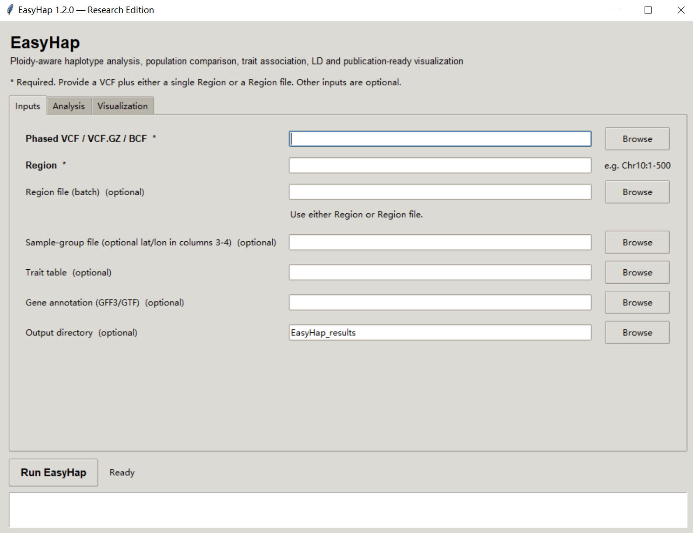
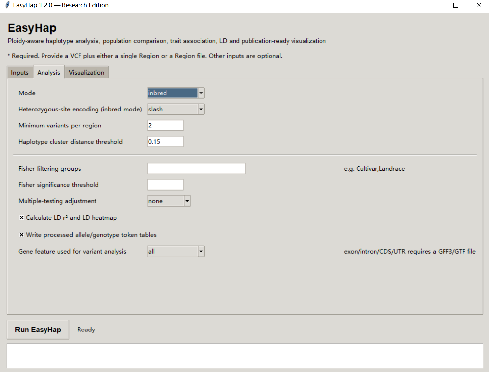
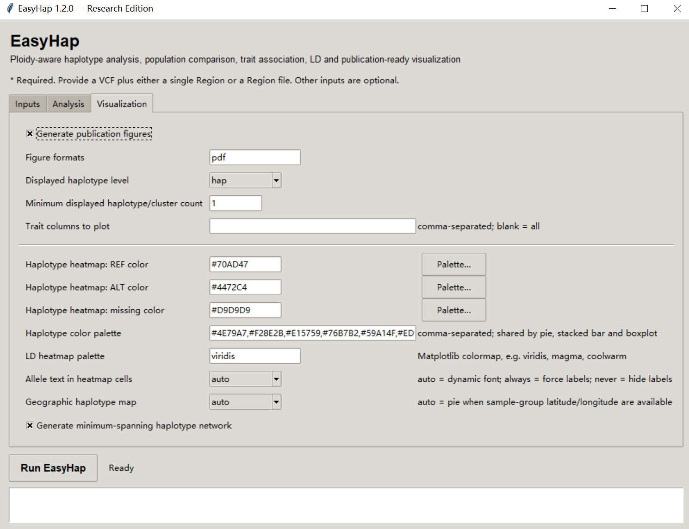

<p align="center">
  
</p>

**EasyHap** is a cross-platform toolkit for regional haplotype/genotype analysis and visualization using VCF/BCF or PLINK 1 BED/BIM/FAM genotype data from fungal, plant, and animal population resequencing projects.
EasyHap separates **phase-independent multilocus genotype analysis** from **copy-resolved haplotype reconstruction**. Unphased VCF is accepted in `genotype` mode, whereas heterozygous genotypes must be phased for `copy` mode. EasyHap recognizes haploid, diploid, and polyploid genotype vectors and integrates variant recoding, haplotype/genotype reconstruction, population comparison, sequence-similarity clustering, sequence export, phenotype association, and publication-ready visualization.

Documentation: https://github.com/Guangqi-He/EasyHap/wiki  

## Workflow 

## Key features
- VCF, VCF.GZ, and BCF input; unphased data are supported in phase-independent genotype mode
- Haploid, diploid, and polyploid genotype support
- `genotype` mode for phase-independent multilocus genotypes and `copy` mode for copy-resolved haplotypes (legacy aliases: `inbred`/`hybrid`)
- SNPs, indels, multiallelic sites, and sequence/symbolic PAV/SV alleles, with structural absence (`ABS`) distinguished from ordinary missing GT
- Haplotype reconstruction and sequence-similarity clustering
- Group-wise haplotype frequency, diversity, and private-haplotype analysis
- Trait-associated haplotype statistics with Kruskal-Wallis and BH-adjusted pairwise Mann-Whitney U tests
- Pairwise dosage-based LD (`r²`) and inverted-triangle LD heatmaps
- Strand-aware gene structure + haplotype and gene structure + LD visualizations
- Pie charts, stacked barplots, trait boxplots, and REF/ALT haplotype heatmaps
- Geographic and network visualization
- Gene-structure variant filtering
- Custom allele colors, haplotype color palettes, and LD heatmap colormaps
- FASTA, PHYLIP, and NEXUS haplotype sequence export
- PDF, SVG, and high-resolution PNG figures
- Batch-region analysis with automatic skipping of low-information intervals
- PLINK 1 `.bed/.bim/.fam` input in genotype mode through both the CLI and graphical interface
- Command-line and Tkinter graphical interfaces

## What's new in 1.3.0
See [CHANGELOG.md](CHANGELOG.md) for the detailed change history.

## Installation
### installation with an existing Python environment (Linux/MacOS)
EasyHap requires Python 3.9 or later.
```bash
unzip EasyHap_Linux.zip
cd EasyHap
python -m pip install -r requirements.txt
python -m pip install -e .
easyhap analyze --help
```
#### installation in a Conda environment (Linux/MacOS)
```bash
conda create -n easyhap python=3.10 -y
conda activate easyhap
unzip EasyHap-xxx.zip
cd EasyHap-xxx/Linux
python -m pip install -r requirements.txt
python -m pip install -e .
easyhap analyze --help
```
### Windows
The Windows release provides a standalone executable and does not require a separate Python installation.
1. Download the Windows `EasyHap.exe` release.
2. Double-click `EasyHap.exe`.
3. Use the supplied example files to test the workflow.
<table>
  <tr>
    <td colspan="2" align="center">
      
    </td>
  </tr>
  <tr>
    <td align="center"></td>
    <td align="center"></td>
  </tr>
</table>

## Phased vs unphased input: which mode should I use?

EasyHap does **not** internally phase genotypes. This is intentional: statistical/read-based phasing is a specialized task, and the appropriate method differs between diploid, polyploid, pedigree, short-read, and long-read datasets.

- `--mode genotype` (default): accepts phased **or unphased** VCF/BCF. It builds a phase-independent multilocus genotype state. For example, `0/1` and `1/0` are canonicalized to the same state. This mode is appropriate for highly inbred/selfing materials, PAV-dominant analyses, PLINK input, or analyses where chromosome-copy assignment is not required.
- `--mode copy`: reconstructs one haplotype per chromosome copy. Any **heterozygous unphased** genotype such as `0/1`, `1/2`, or `0/1/1/2` triggers an informative error. Homozygous calls such as `0/0` do not require meaningful phase because copy assignment is identical.

Legacy mode names remain accepted for backward compatibility: `inbred` = `genotype`, `hybrid` = `copy`.

### If your VCF is not phased

For a diploid population, **Beagle 5.5** is a convenient statistical phasing option. A minimal example is:

```bash
java -Xmx32g -jar beagle.27Feb25.75f.jar gt=input.vcf.gz out=input_beagle_phased nthreads=16
```

This produces `input_beagle_phased.vcf.gz`. A genetic map can be supplied when available, for example `map=genetic_map.txt`. Beagle phases genotypes and can impute sporadically missing genotypes during phasing; check Beagle's documentation and choose options that match your study design.

For read-backed diploid phasing, **WhatsHap** can be used when BAM/CRAM reads are available:

```bash
whatshap phase --reference reference.fa -o phased.vcf.gz input.vcf.gz input.bam
```

For polyploids, WhatsHap provides `polyphase`:

```bash
whatshap polyphase input.vcf.gz input.bam --ploidy 4 --reference reference.fa -o phased_polyploid.vcf.gz
```

WhatsHap's documentation notes that its standard read-based phasing handles SNVs and small/complex sequence variants, while structural variants are not phased by that workflow. Therefore, do not assume that an SV/PAV is copy-resolved merely because nearby SNPs are phased.

For large diploid datasets, **SHAPEIT5** is another option. A typical chromosome-level command is:

```bash
phase_common --input input.bcf --region 1 --map chr1.gmap.gz --output chr1.phased.bcf --thread 16
```

After external phasing, run EasyHap copy mode, for example:

```bash
easyhap analyze \
  --vcf input_beagle_phased.vcf.gz \
  --group groups.tsv \
  --gff annotation.gff3 \
  --region Chr10:100000-120000 \
  --mode copy \
  --plot \
  --plot-format pdf,png \
  --outdir GeneA_copy_haplotypes
```

## Quick start
### Minimal analysis
```bash
easyhap analyze --vcf input.vcf.gz --region Chr10:100000-120000
```
Exactly one genotype source (`--vcf` or `--bfile`) and one region source (`--region` or `--region-file`) are required. The default `--mode genotype` does **not** require phasing. Use `--mode copy` only with VCF/BCF when chromosome-copy-resolved haplotypes are needed. Results are written to `EasyHap_results` by default.
### PLINK BED/BIM/FAM analysis
```bash
easyhap analyze --bfile cohort --region 1:100000-200000 --mode genotype --outdir cohort_region
```
`cohort.bed`, `cohort.bim`, and `cohort.fam` are read as one PLINK dataset. EasyHap 1.3 uses BIM-coordinate indexing and direct BED seeks for regional access instead of rescanning the complete BED file for every region.

### Population analysis with figures
```bash
easyhap analyze --vcf input.vcf.gz --group groups.tsv --gff annotation.gff3 --region Chr10:100000-120000 --plot --plot-format pdf,png --outdir GeneA_results
```
### Batch analysis
```bash
easyhap analyze --vcf input.vcf.gz --group groups.tsv --gff annotation.gff3 --region-file regions.tsv --plot --plot-format pdf,png --outdir batch_results
```
Regions with fewer than `--min-variants` retained variants are skipped and recorded in `EasyHap.log`.
### Trait, gene structure, and LD analysis
```bash
easyhap analyze --vcf input.vcf.gz --group groups.tsv --traits traits.tsv --trait-cols Plant_height,Seed_weight --gff annotation.gff3 --region Chr10:100000-120000 --plot --plot-format pdf,png --outdir GeneA_results
```
### Custom plot palettes
```bash
easyhap analyze --vcf input.vcf.gz --group groups.tsv --gff annotation.gff3 --region Chr10:100000-120000 --plot --plot-format pdf,png --hap-palette "#4E79A7,#F28E2B,#E15759,#76B7B2,#59A14F" --ld-cmap magma
```
`--hap-palette` controls haplotype colors in the pie chart, stacked barplot, and trait boxplot. `--ld-cmap` accepts a Matplotlib colormap name such as `viridis`, `magma`, `plasma`, `coolwarm`, or `RdYlBu_r`.

### Structural absence vs missing genotype

EasyHap keeps ordinary missing genotype and genomic absence separate:

- `./.` or another no-call without structural evidence -> `N` (missing GT).
- VCF spanning-deletion allele `*` -> `ABS` (genomic/structural absence).
- For an explicit deletion/PAV with a known interval (`END`, sequence-resolved deletion, or an equivalent deletion allele), downstream markers inside the deleted interval are masked as `ABS` only when the sample/copy genotype supports that deletion.
- An unphased heterozygous deletion is **not** arbitrarily assigned to one chromosome copy.

In haplotype-distance calculations, downstream `ABS` markers are treated as non-comparable states so that one large deletion is not counted repeatedly as dozens of independent SNP differences; the deletion/PAV event itself remains an informative haplotype feature.

### Multiallelic and overlapping variants

EasyHap preserves the VCF allele index for indels/SVs, so two ALT alleles with the same length but different sequences remain distinct states. For example, `REF=A, ALT=AT,AG` is represented by two unique ALT tokens rather than collapsing both to `+1`.

Overlapping records are retained and reported in `*.VariantOverlap.tsv`:

- a SNP/InDel inside a supported deletion interval can be structurally masked as `ABS`;
- same-start SNP/InDel records are retained separately;
- nested/shared-breakpoint complex SV records are retained separately and reported rather than being automatically reinterpreted as a caller-independent complex allele.

EasyHap therefore does not claim to resolve arbitrary caller-specific complex-SV representations automatically.

### PLINK input

PLINK 1 binary files are accepted in phase-independent genotype mode:

```bash
easyhap analyze \
  --bfile cohort \
  --region 1:100000-200000 \
  --mode genotype \
  --outdir cohort_region
```

`cohort.bed`, `cohort.bim`, and `cohort.fam` must all be present. `--bfile` may be given as the bare prefix or as the path to any one member of the trio; EasyHap normalizes it to the common prefix. PLINK BED genotypes are biallelic and unphased, so `--mode copy` is intentionally disabled. EasyHap 1.3 builds a chromosome/position index from BIM and seeks directly to fixed-width SNP-major BED records; in batch analyses the reader/index is reused across regions. EasyHap follows PLINK's own VCF-export convention internally (BIM allele 2 as REF-index 0, allele 1 as ALT-index 1), but these labels should not be interpreted as proof of reference-genome ancestry.

## Main command-line options
### Required inputs
| Option | Description |
|---|---|
| `--vcf` | VCF, VCF.GZ, or BCF file; mutually exclusive with `--bfile` |
| `--bfile` | PLINK 1 binary prefix (`.bed/.bim/.fam`); genotype mode only |
| `--region` | One genomic interval, e.g. `Chr10:100000-120000` |
| `--region-file` | TAB-delimited batch interval file; use instead of `--region` |
### Optional biological inputs
| Option | Description |
|---|---|
| `--group` | TAB-delimited sample-group file without a header |
| `--traits` | TAB-delimited trait table with a header; first column is sample/accession |
| `--trait-cols` | Comma-separated trait columns to analyze/plot; blank means all trait columns |
| `--gff` | GFF3/GTF annotation used for gene structure visualization |
### Analysis options
| Option | Default | Description |
|---|---:|---|
| `--mode` | `genotype` | `genotype` for phase-independent multilocus states or `copy` for copy-resolved haplotypes; `inbred`/`hybrid` remain aliases |
| `--hetero-policy` | `slash` | Heterozygous-site encoding in inbred mode: `slash`, `iupac`, or `missing` |
| `--min-variants` | `2` | Minimum retained variants required for a region |
| `--gene-feature` | `all` | Restrict variants to the selected feature of the primary overlapping gene; non-all choices require --gff [all] |
| `--cluster-threshold` | `0.15` | Sequence-distance threshold for haplotype clustering |
| `--fisher-groups` | — | Two comma-separated groups for optional variant filtering |
| `--fisher-alpha` | — | Significance threshold for Fisher filtering |
| `--fisher-adjust` | `none` | Multiple-testing adjustment: `none` or `bh` |
| `--vcf-backend` | `auto` | VCF reader: `auto`, `cyvcf2`, `pysam`, or `plain` |
| `--no-ld` | off | Disable LD calculation and LD plotting |
| `--no-processed` | off | Do not write processed allele/genotype tables |
| `--outdir` | `EasyHap_results` | Output directory |

### Visualization options
| Option | Default | Description |
|---|---:|---|
| `--plot` | off | Generate standalone figures |
| `--plot-format` | `pdf` | Comma-separated output formats: `pdf`, `svg`, `png` |
| `--plot-hap-level` | `hap` | Plot individual haplotypes (`hap`) or clusters (`cluster`) |
| `--plot-min-count` | `1` | Minimum class count retained in displayed haplotype/cluster plots |
| `--palette` | — | Compact REF,ALT[,MISSING] allele heatmap palette |
| `--ref-color` | `#70AD47` | REF cell color in haplotype heatmaps |
| `--alt-color` | `#4472C4` | ALT cell color in haplotype heatmaps |
| `--missing-color` | `#D9D9D9` | Missing-genotype cell color in haplotype heatmaps |
| `--absence-color` | `#FFFFFF` | Genomic/structural-absence (`ABS`) cell color |
| `--hap-palette` | built-in palette | Comma-separated haplotype colors used consistently in pie, stacked-bar, and trait boxplots |
| `--ld-cmap` | `viridis` | Matplotlib colormap used for the LD heatmap |
| `--cell-text` | `auto` | Allele/base labels inside haplotype heatmap cells |
| `--map-style` | `auto` | Geographic haplotype overlay when sample-group columns 3-4 contain latitude/longitude: auto=pie [auto] |
| `--no-network` | `auto` | Disable minimum-spanning haplotype network output |

For the full input specifications, statistical definitions, output-file descriptions, examples, and troubleshooting, see the [EasyHap Wiki](https://github.com/Guangqi-He/EasyHap/wiki).

## Input overview

- **VCF/BCF:** phased or unphased input is accepted in `genotype` mode; heterozygous genotypes must be phased for `copy` mode.
- **PLINK BED/BIM/FAM:** accepted in `genotype` mode through `--bfile PREFIX`.
- **Region file:** TAB-delimited `chrom  start  end`, without a header.
- **Group file:** TAB-delimited `sample  group`, without a header.
- **Trait table:** TAB-delimited with a header; the first column is the sample/accession identifier.
- **GFF3/GTF:** gene, transcript, exon, CDS, and UTR records are recognized for visualization.

Detailed examples are provided in the `examples/` directory and in the Wiki. Synthetic reviewer-validation datasets covering unphased diploids, highly heterozygous phased diploids, autotetraploids, subgenome-separated allotetraploid examples, multiallelic/overlapping records, and large deletions are in `examples/reviewer_validation/`. Each validation dataset includes a matching group file and GFF3 annotation so the documented commands can directly generate population and gene-structure plots in both PDF and PNG formats.

## Graphical interface
Launch the GUI with:
```bash
python easyhap_gui.py
```
The GUI is organized into **Inputs**, **Analysis**, and **Visualization** tabs. In EasyHap 1.3, the Inputs tab provides a genotype-source selector for either **VCF/VCF.GZ/BCF** or **PLINK 1 BED/BIM/FAM**. When PLINK is selected, browsing any `.bed`, `.bim`, or `.fam` file automatically derives the shared prefix, and the analysis is restricted to genotype/inbred mode because BED is unphased. The Visualization tab includes separate controls for REF/ALT/missing colors, a shared haplotype color palette for pie/stacked-bar/trait plots, and the LD heatmap colormap.

## License
EasyHap is distributed under the GNU General Public License v3.0 or later (GPL-3.0-or-later).

## Author
Guangqi He
